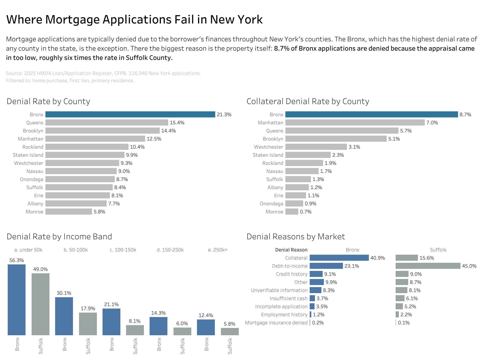
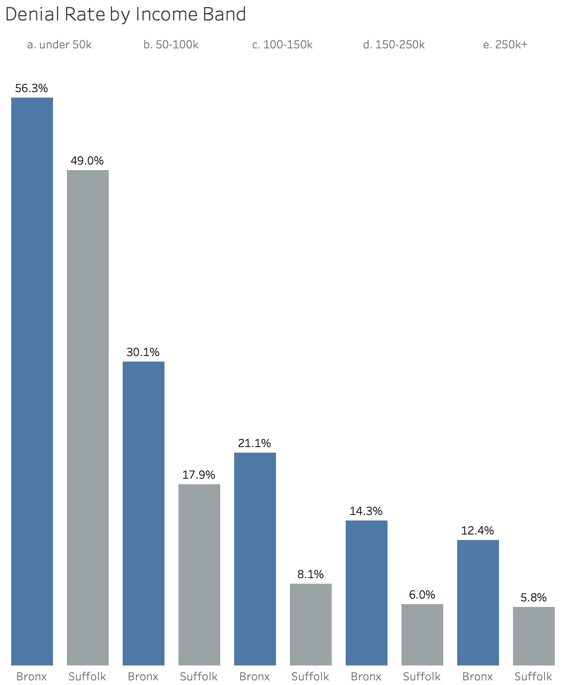
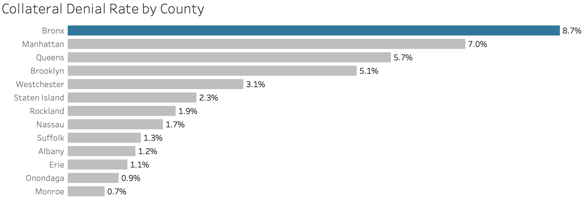

# Where Mortgage Applications Fail in New York

**A denial reason analysis of 2025 HMDA lending data**

SQL · Tableau · 116,940 applications

**[View the dashboard](https://public.tableau.com/views/WhereMortgageApplicationsFailinNewYork/Dashboard1)**



---

## Executive Summary

In most of New York's counties, mortgage applications are denied because of the 
borrower's finances. In New York City that is not the case.

The Bronx has the highest mortgage denial rate of any county at 21.3%. 
Income does not explain it. The gap against Suffolk County is there at every
income level. Credit history does not explain it either since it accounts for
about 9% of denials in both places.

The difference is the property. 8.7% of Bronx applications are denied over
collateral which means the appraisal came in below the agreed price.
In Suffolk it is 1.3%.

---

## Business Problem

Processing a mortgage application costs a lender money: credit pulls, 
underwriting time and the appraisal. When an application is denied over the
appraisal, most of that money has already been spent.

Lenders track their overall denial rate but that number does not show where
in the process applications are failing. A market where applications fail 
on affordability needs different handling from one where they fail on 
valuation.

This analysis looks at where applications fail across New York and what causes
it. 

---

## Data

2025 HMDA Loan/Application Register, published by the CFPB in April 2026. 
Pulled from the Data Browser API, filtered to New York State and action codes
1, 2 and 3.

| | Records |
|---|---|
| Decisioned applications, New York State | 320,184 |
| After filtering | 116,940 |

The public file leaves out some information for privacy. There are no credit
scores. Loan amounts and property values are rounded to $10,000 midpoints.
Debt-to-income is reported in bands rather than exact numbers. A lender working
with its own data would see more.

---

## How I Approached It

**Defining the denial rate.** HMDA records eight outcome codes. Three of them 
are applications that received a decision: approved, approved but not accepted
and denied. The others are withdrawn, incomplete or loans purchased from
another institution, which were never applications here. I pulled codes 1, 2, 
3 only so the denial rate is denials divided by applications that got a
decision.

**Choosing the population.** Raw HMDA combines home purchases with home
improvement loans, refinances, investment properties and second liens. These
are underwritten differently and denied at different rates. Filtering to home
purchase, first lien, primary residence brings the statewide rate from 24%
down to 12%. Without that filter, differences in product mix would show up as
differences between counties.

**Testing income.** I split both counties into five income bands and compared
them band by band. If income were the reason, the gap should close when
comparing people who earn the same amount. It does not.

**Testing housing type.** The Bronx has more two to four unit buildings than
Suffolk and those are appraised differently. I compared single family homes
only. The gap got wider.

**Choosing Suffolk as the comparison.** It has the most applications of any
county in the filtered data at 11,865 and it is the closest large suburban
market to the city. I avoided comparing the highest county to the lowest,
since that would exaggerate any gap.

---

## What I Found

### Where are the Applications Failing?

The Bronx, more than anywhere else in New York State.

| County | Denial Rate | Applications |
|---|---|---|
| Bronx | 21.3% | 2,271 |
| Queens | 15.4% | 9,112 |
| Brooklyn | 14.4% | 6,938 |
| Manhattan | 12.5% | 5,211 |
| Rockland | 10.4% | 2,254 |
| Staten Island | 9.9% | 3,108 |
| Westchester | 9.3% | 7,034 |
| Nassau | 9.0% | 9,250 |
| Onondaga | 8.7% | 4,002 |
| Suffolk | 8.4% | 11,865 |
| Erie | 8.1% | 7,968 |
| Albany | 7.7% | 2,509 |
| Monroe | 5.8% | 6,571 |

That is two and a half times Suffolk County and higher than any county upstate.

### Is it because the Bronx is poorer?

That was the first thing I checked, it is not.



| Household Income | Bronx | Suffolk | Ratio |
|---|---|---|---|
| under $50k | 56.3% | 49.0% | 1.1x|
| $50-$100k | 30.1% | 17.9% | 1.7x |
| $100-$150k | 21.1% | 8.1% | 2.6x |
| $150-$250k | 14.3% | 6.0% | 2.4x |
| $250k+ | 12.4% | 5.8% | 2.1x|

The gap appears in every band and is widest in the middle. A Bronx household
earning $100-$150k is denied more often than a Suffolk household earning half
that. Above $250k it is still 12.4% against 5.8% and those are buyers who can
clearly afford the loan.

The under $50k row is based on only 64 Bronx applications, so I would not rely 
on it. 

### Is it credit?

No. Credit history accounts for 9.1% of Bronx denials and 9.0% of Suffolk's.

### So what is it?

The property.



| Denial Reason | Bronx | Suffolk |
|---|---|---|
| Collateral | 40.9% | 15.6% |
| Debt-to-Income | 23.1% | 45.0% |
| Credit History | 9.1% | 9.0% |

The two biggest reasons swap places. In Suffolk, most denials come down to 
affordability. In the Bronx, most come down to the appraisal.

As a share of all applications rather than of denials, 8.7% of Bronx applications are denied over collateral, against 1.3% in Suffolk.
Comparing single family homes only, which rules out the Bronx's multi unit
housing stock, the gap widens to 11.2% against 1.3%.

This is not limited to the Bronx. Manhattan at 7.0%, Queens at 5.7% and
Brooklyn 5.1% are all above every suburban county. The Bronx is the most
extreme case.

---

## Things I Got Wrong or Did Not Expect

My first pass gave a 24% denial rate, which seemed too high. Home improvement
loans were pushing it up and they judged on different criteria. That made me
reconsider what population I was measuring.

I also expected the boroughs to have the most applications. They do not. In the
raw file, Suffolk and Nassau each have more mortgage applications than any
borough and Manhattan has fewer than Rochester. New York Ciry is mostly
renters and co-ops which neither appears much in this data.

---

## What I would Recommend

**Track collateral denials as a separate measure.** An overall denial rate
treats an application that fails early as the same as one that fails at the
appraisal. The second is more expensive because the credit pull, underwriting
time and appraisal have already been paid for.

**Get a valuation earlier in markets like the Bronx.** If appraisals are causing
8% of applications to fail, an automated valuation at the start would identify
the problem before those costs are incurred.

**Set expectations with borrowers in these markets.** A buyer with strong
finances in the Bronx still faces the real appraisal risk. That concern is worth
raising early rather than late in the process.

---

## What This Cannot Tell You

A collateral denial means the appraisal came in below the contract price. The
data does not say why. Possible explanations include limited comparable sales, 
property condition, buyers agreeing to prices the market will not support or
valuation practices.

Distinguishing between them would require appraisal level data with comparable
sales which is not publicly available.

---

## Next Steps

**Lender level.** Each record identifies the institution that received the
application. This would show whether the collateral gap is spread across each
lender in the Brox or concentrated in a few areas.

**Loan-to-value.** If Bronx buyers are putting down less that would partly
explain collateral denials. It is the next objection someone would raise.

**Multi-year.** The Data Browser API covers 2018 to 2025 in this format, which
would show whether the gap is widening or narrowing.

## Tools

SQL (SQLite) + Tableau Public + Git

## Reproducing This

Pull the data:

```
curl -L "https://ffiec.cfpb.gov/v2/data-browser-api/view/csv?years=2025&states=NY&actions_taken=1,2,3" -o data/hmda_ny_2025.csv
```

Load it:

```
sqlite3 hmda.db
.import --csv data/hmda_ny_2025.csv lar
.quit
```

```
sqlite3 hmda.db < sql/01_profile.sql
sqlite3 hmda.db < sql/02_clean.sql
sqlite hmda.db < sql/03_denial_rate.sql
sqlite hmda.db < sql/04_income_bands.sql
sqlite hmda.db < sql/05_denial_reasons.sql
```

Build the dashboard file: 

```
sqlite3 hmda.db -header -csv < sql/06_export.sql > tableau/dashboard_data.csv
```

The raw CSV and the SQLite database are not in this repo. Both rebuild from the
first command.

| File | What it does |
|---|---|---|
| '01_profile.sql' | What is in the raw file before filtering |
| '02_clean.sql' | Narrowing to home purchase loans people will live in |
| '03_denial_rate.sql' | Denial rate by county |
| '04_income_bands.sql' | Testing whether income explains the gap |
| '05_denial_reasons' | Why applications get denied and whether housing types
explains it |
| '06_export.sql' | Building the file the dashboard runs on |


 


